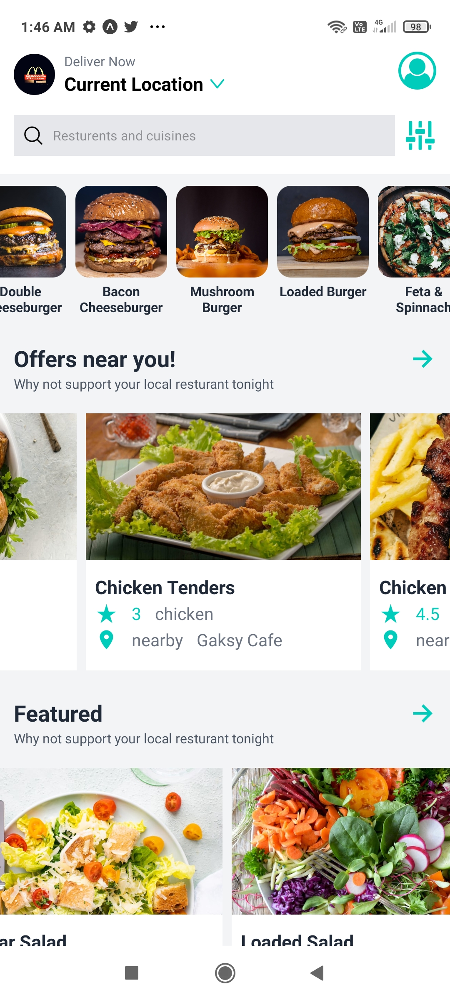
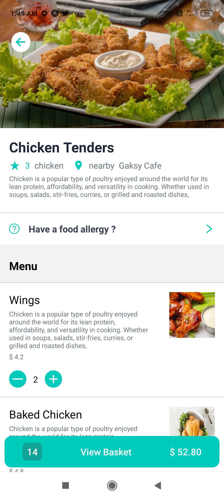
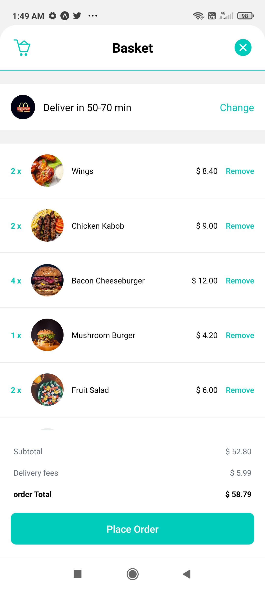
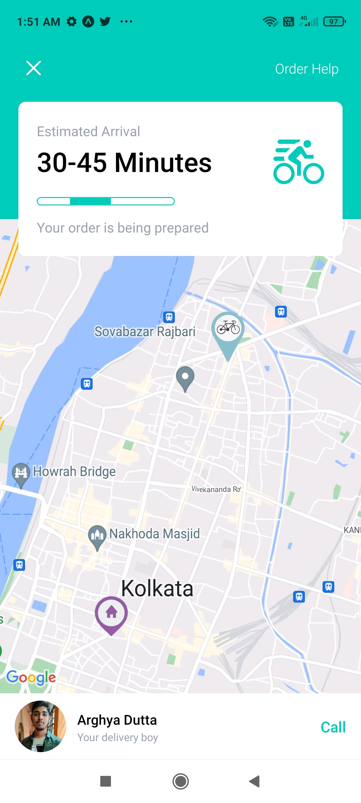

<h1 align='center'>Food-Delivery-App</h1>

<h3 align='center'>Getting Started with Expo Go</h3>

<h4 align='center'>This project was bootstrapped with Expo and React Native</h4>

## <h3> Tools and technology Used : </h3>

## <h3 align='center'> Sample UI of our Cross-Platform Mobile-App </h3>

## Installation

To run the app locally, you will need to have [Node.js](https://nodejs.org/) and [Expo](https://www.npmjs.com/package/expo) installed on your machine. Once you have these installed, follow these steps:

1. Clone the repository: `git clone https://github.com/arghyadutta080/Food-Delivery-App.git`
2. Install dependencies: `npm install`
3. Run the app: `expo start`
4. Then a QR Code will appear in terminal, scan it with **Expo Go** app, available in both **[Android Play Store](https://play.google.com/store/apps/details?id=host.exp.exponent&pli=1)** and **[iOS App Store](https://apps.apple.com/app/expo-go/id982107779)**.

## Contributing

Contributions to the project are welcome! To contribute, fork the repository and create a new branch for your changes. Once you have made your changes, create a pull request to merge your branch into the main repository.
